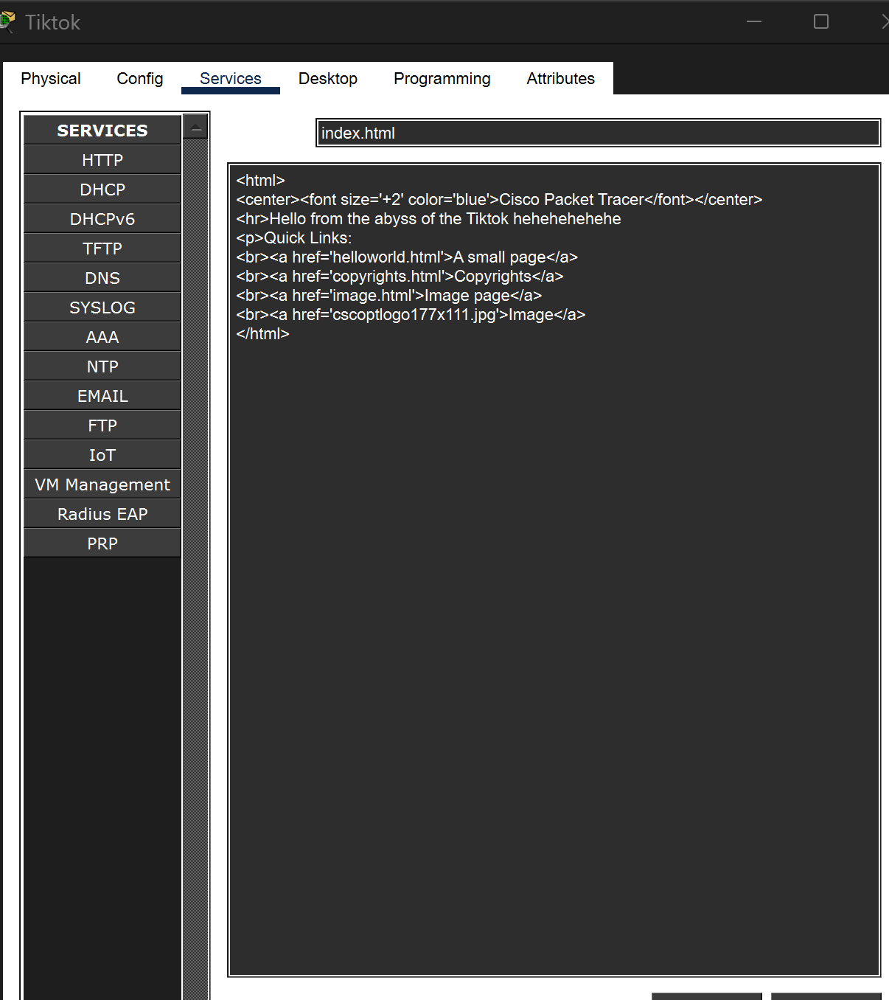
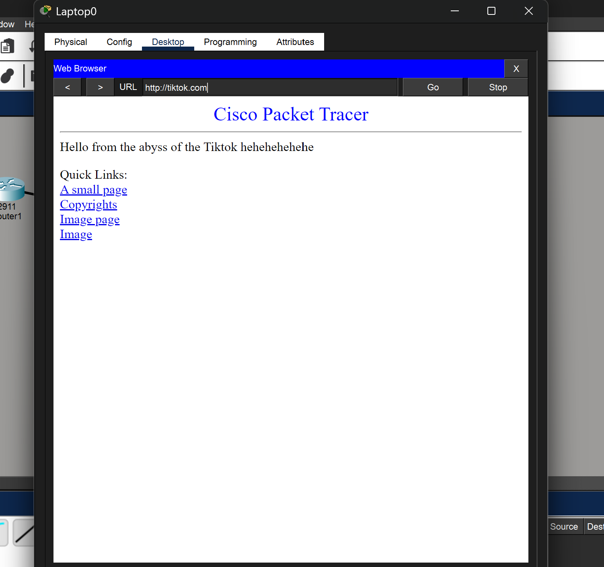

# Cisco DNS & HTTP Server Network Topology

## 📌 Project Overview
This project demonstrates **DNS-based web access** in a network using **Cisco Packet Tracer**.

A client laptop accesses multiple web servers (**TikTok, Google, Facebook, Email**) using  
**domain names instead of IP addresses**, resolved through a **DNS server**.

The network is connected using a **Cisco 2911 router** and a **Cisco 2960 switch**.

---

## 🖧 Network Topology

### Devices Used
- 1 × Cisco 2911 Router  
- 1 × Cisco 2960 Switch  
- 1 × Client Laptop  
- 5 × Servers:
  - DNS Server  
  - TikTok Web Server  
  - Google Web Server  
  - Facebook Web Server  
  - Email Server  

### Topology Diagram

---

## 🌐 IP Addressing Scheme

### 🔹 Client Network (192.168.1.0/24)

| Device | IP Address | Default Gateway | DNS |
|------|-----------|----------------|-----|
| Laptop | 192.168.1.2 | 192.168.1.1 | 10.10.10.10 |
| Router (LAN) | 192.168.1.1 | — | — |

---

### 🔹 Server Network (10.10.10.0/24)

| Server | IP Address | Gateway | DNS |
|------|-----------|--------|-----|
| DNS Server | 10.10.10.10 | 10.10.10.1 | — |
| TikTok Server | 10.10.10.200 | 10.10.10.1 | 10.10.10.10 |
| Google Server | 10.10.10.150 | 10.10.10.1 | 10.10.10.10 |
| Facebook Server | 10.10.10.20 | 10.10.10.1 | 10.10.10.10 |
| Email Server | 10.10.10.100 | 10.10.10.1 | 10.10.10.10 |

---

## 🌍 DNS Configuration

The DNS server resolves domain names to internal server IPs.

| Domain Name | IP Address |
|------------|-----------|
| tiktok.com | 10.10.10.200 |
| google.com | 10.10.10.150 |
| facebook.com | 10.10.10.20 |
| mail.com | 10.10.10.100 |

This allows users to access services using URLs such as:

## 🖥️ HTTP Server Configuration (TikTok)

The TikTok server runs an **HTTP service** with a custom `index.html` page.

---

## 💻 Client Verification

The client laptop successfully accesses the TikTok website using the domain name:

## 🎯 Key Concepts Demonstrated
- DNS Name Resolution  
- HTTP Web Server Configuration  
- Client–Server Communication  
- Router-based Network Design  
- Cisco Packet Tracer Simulation  

